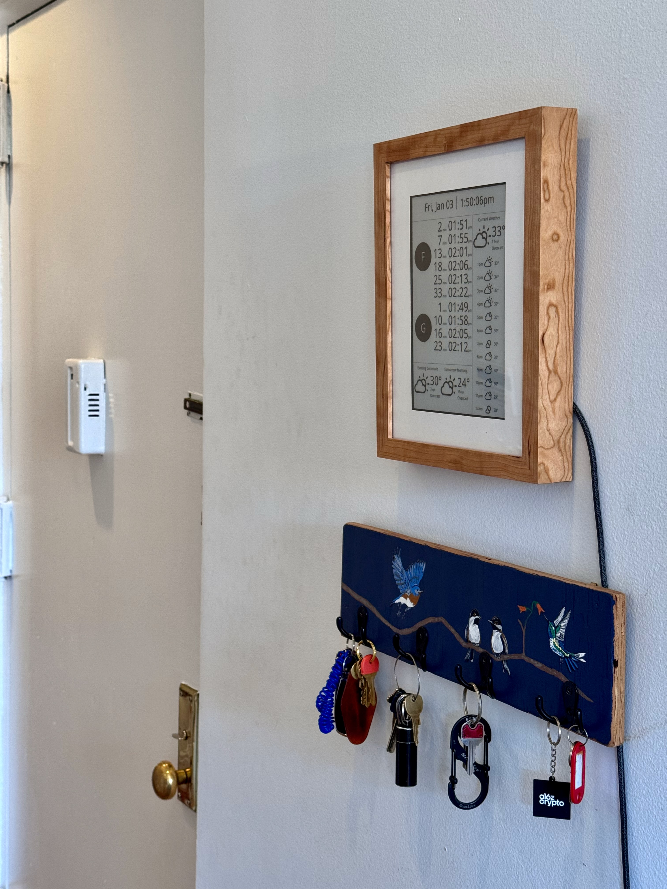
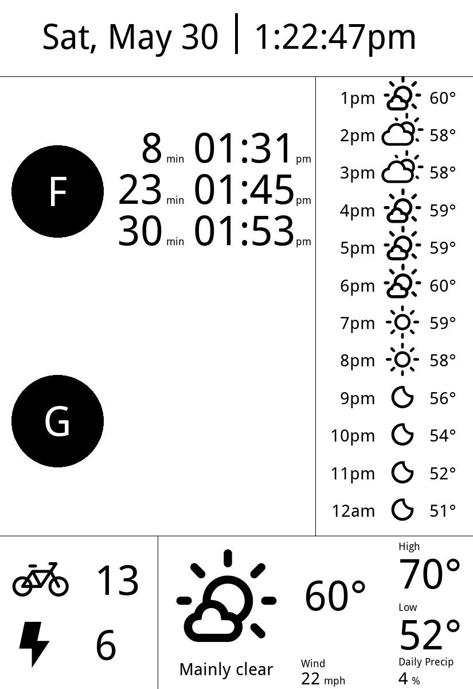

# e-ink Subway & Weather Display
A Raspberry Pi-powered e-ink display showing real-time subway arrival times, Citi Bike availability, and weather forecasts. Perfect for mounting on your wall to check train times and weather before heading out.

Full Post [here](https://sambroner.com/posts/raspberry-pi-train).

# Features
- Real-time subway arrival times (NYCT GTFS feeds — no API key)
- Current Citi Bike availability for a station (GBFS feeds — no API key)
- Current weather and hourly/daily forecast (Open-Meteo — no API key)
- BirdNET-Pi observation and collage screens fetched over SSH from a remote SQLite database
- Debug mode with automatic image preview
- Native e-ink display support on Raspberry Pi

<p align="center">
  
  &nbsp;&nbsp;
  
</p>

<p align="center"><sub><b>Left:</b> mounted on the wall in a laser-cut mat &amp; frame. &nbsp; <b>Right:</b> a render of the display output.</sub></p>

## Getting Started

### Hardware
- Raspberry Pi 4b+
    - SD Card, power supply, (optionally keyboard, mouse, hdmi cord, etc.)
- [Waveshare 9.7inch E-Ink display HAT for Raspberry Pi](https://www.waveshare.com/product/displays/e-paper/9.7inch-e-paper-hat.htm)
- Optional MPR121 capacitive touch breakout for screen switching

(For the frame and mounting, see [Physical Build](#physical-build) below.)

### Raspberry Pi Setup
0. Figure out how you're going to connect to the Raspberry Pi
1. Install uv and Git LFS
2. Enable the SPI interface
3. Attach the e-ink display to the Raspberry Pi

```bash
git lfs install
git clone https://github.com/SamBroner/subway-e-ink-tracker.git
cd subway-e-ink-tracker
git lfs pull
uv sync
```

Bird illustration assets are stored in Git LFS. If you skip `git lfs pull`, the
transit display still runs, but bird screens will use missing-art placeholders.
The illustrations were created by Sam Broner with Gemini image generation; see
`assets/birds/README.md` for provenance notes.

### Installation
1. Install uv (if not already installed)
2. Install dependencies:
   ```bash
   uv sync
   ```
3. Set up your environment file:
   ```bash
   cp config/.env.template config/.env
   # then edit config/.env with your station IDs and preferences
   ```

### Configuration

All configuration lives in `config/.env` (gitignored — your personal values stay
local). Copy `config/.env.template` and fill it in:

| Variable | Required | Description |
|---|---|---|
| `STATION_ID` | yes | MTA station ID for arrivals (e.g. `F20S`) |
| `TRAIN_LINE_1`, `TRAIN_LINE_2` | yes | Train lines to monitor (e.g. `F`, `G`) |
| `CITIBIKE_STATION_ID` | yes | Citi Bike station UUID (see below) |
| `CITIBIKE_STATION_NAME` | yes | Display name for the bike station |
| `WEATHER_LAT`, `WEATHER_LON` | no | Coordinates (defaults to NYC center) |
| `BIRDNET_SSH_HOST` | no | SSH host alias for the BirdNET-Pi sensor (defaults to `birdnet`) |
| `BIRDNET_DB_PATH` | no | Remote BirdNET-Pi SQLite path (defaults to `~/BirdNET-Pi/scripts/birds.db`) |
| `BIRD_WINDOW_HOURS` | no | Observation summary window for the bird screen (defaults to `24`) |
| `BIRD_RESULT_LIMIT` | no | Max grouped species returned by the bird feed (defaults to `15`) |
| `BIRD_UPDATE_SECONDS` | no | Bird feed refresh interval (defaults to `900`) |
| `BIRD_ASSET_DIR` | no | Local bird illustration directory |
| `BIRD_MOCK_DATA` | no | Local mock bird result JSON for debug rendering |
| `BIRD_USE_MOCK_DATA` | no | `true` makes the bird service read `BIRD_MOCK_DATA` instead of SSH |
| `WEATHER_UPDATE_SECONDS` | no | Weather feed refresh interval (defaults to `300`) |
| `SUBWAY_UPDATE_SECONDS` | no | Subway feed refresh interval (defaults to `5`) |
| `CITIBIKE_UPDATE_SECONDS` | no | Citi Bike feed refresh interval (defaults to `60`) |
| `DISPLAY_MIN_INTERVAL_SECONDS` | no | Minimum interval for routine display redraws (defaults to `1`) |
| `DISPLAY_CLEAR_COOLDOWN_SECONDS` | no | Cooldown after large display updates (defaults to `5`) |
| `TOUCH_ENABLED` | no | `true` enables optional MPR121 capacitive touch screen switching |
| `TOUCH_CHANNEL` | no | MPR121 electrode index to poll (defaults to `0`) |
| `TOUCH_I2C_ADDRESS` | no | MPR121 I2C address (defaults to `0x5a`) |
| `DEBUG` | no | `true` saves a render to `debug_output/` instead of driving the display |
| `DEBUG_FRAME_HISTORY` | no | `true` also saves timestamped debug frames and `debug_output/frame_manifest.csv` |
| `QUIET_MODE` | no | `true` suppresses console output |

Values provided in the shell take precedence over `config/.env`, which is useful
for smoke tests such as `DEBUG=true QUIET_MODE=false uv run runner.py`.

Find your Citi Bike station's UUID and name in the GBFS feed:
<https://gbfs.citibikenyc.com/gbfs/en/station_information.json>

### Optional Touch Input

The app can use one MPR121 capacitive touch electrode to advance screens. Wire
the breakout to Raspberry Pi I2C bus 1:

| Wire | Pi connection |
|---|---|
| red | pin 1 / 3.3V |
| blue | pin 3 / SDA |
| yellow | pin 5 / SCL |
| black | pin 6 / GND |
| brass button | MPR121 E0 |

Enable it with:

```bash
TOUCH_ENABLED=true
TOUCH_CHANNEL=0
TOUCH_I2C_ADDRESS=0x5a
```

`sudo i2cdetect -y 1` should show `5a`.

### Running

If `DEBUG=true` in your environment:
- Images will be saved to `debug_output/current_display.png`
- If `DEBUG_FRAME_HISTORY=true`, timestamped frames are also saved to `debug_output/frames/` with timing metadata in `debug_output/frame_manifest.csv`
- Your system's default image viewer will automatically open and update with each refresh
- The image viewer will refresh automatically when new data arrives

If `DEBUG=false`:
- On Raspberry Pi: The e-ink display will update
- On other platforms: An error will be raised (e-ink display only works on Raspberry Pi)

To run:
```bash
uv run runner.py
```

Screen switching cycles through:

```text
transit
bird-collage-named
birds
bird-profile
```

## Physical Build

The display reads best when it's framed like a piece of art rather than left as a
bare panel. The key is a **laser-cut mat**: a precise cutout window holds the e-ink
panel square and aligned behind the glass, and gives it a clean, finished border.

- **Frame:** I used this [natural cherry gallery frame](https://www.americanframe.com/natural-cherry-gallery-frame).
- **Mat:** a custom **laser-cut mat** sized to the display's active area, also from
  [American Frame](https://www.americanframe.com/). This is what makes the mount look
  intentional and keeps everything aligned.

See the [full write-up](https://sambroner.com/posts/raspberry-pi-train) for the
framing and mounting technique, including how the Pi and ribbon cable tuck behind.

## Testing

Run the full test suite from the repo root:

```bash
uv run pytest
```

Some hardware checks are Raspberry Pi-only and skip automatically when the
required SPI/GPIO libraries are unavailable.

## CairoSVG

- CairoSVG is used to convert SVGs to PNGs for the display.
- On mac, you may need to manually compile Cairo: https://stackoverflow.com/questions/36225410/installing-cairo-and-pycairo-mac-osx

## Display Modes
Figuring out the right display mode was annoying. The full spec is [here](https://www.waveshare.net/w/upload/c/c4/E-paper-mode-declaration.pdf).

## To Do
- [ ] Consider checking if the wait time still makes sense and then refresh. E.g. It's 11am. Train Arrives at 11:04 and there's no update. When time turns to 11:01, even if no update, refresh.
- [ ] Fix hourly weather... seems like it's only 100% or zero?

## Credits
- IT8951 library by GregDMeyer: https://github.com/GregDMeyer/IT8951

## Setting up as a service
To have the display start automatically on boot, create a systemd service:

```ini
[Unit]
Description=Subway E-Ink Display Service
After=network.target

[Service]
Type=simple
User=<your-username>
WorkingDirectory=/path/to/repo
ExecStart=/path/to/uv run runner.py
Restart=always
RestartSec=10

[Install]
WantedBy=multi-user.target
```

Then manage it with:
```bash
sudo systemctl restart subway-eink.service
sudo systemctl stop subway-eink.service
```

# Project Structure

```
.
├── runner.py            # main loop: fetch data, render, update display
├── utils.py             # icon rendering + shared helpers
├── config/
│   ├── config.py        # all configuration + display geometry
│   └── .env.template    # copy to config/.env and fill in
├── services/
│   ├── subway_service.py    # MTA arrivals
│   ├── citibike_service.py  # Citi Bike availability
│   ├── bird_service.py      # BirdNET-Pi SQLite-over-SSH observations
│   ├── weather_service.py   # Open-Meteo weather
│   └── weather_codes.py     # WMO weather code sets
├── ui/
│   ├── display.py       # e-ink / debug display driver
│   ├── layout.py        # screen layout + drawing
│   ├── screens.py       # registered screens + screen switching order
│   ├── render_cache.py  # in-memory rendered screen cache
│   └── fonts.py         # font loading
├── assets/
│   ├── fonts/           # Font.ttc
│   ├── birds/           # BirdNET mock data + LFS illustration assets
│   ├── bitmaps/         # display test bitmaps
│   └── icons/           # weather + UI (bike, bolt) SVG icons
└── tests/               # unit tests + Pi hardware checks
```

## Follow-up TODOs

- Remove the vendored `cairo-1.14.6/` tree and replace it with platform install notes.
- Add a real weather-unavailable render path for degraded payloads missing `current`.
- Add repo-level license metadata.
- Add CI for `uv run pytest`.
- Extract shared bird text fitting, count, and last-seen formatting helpers from the bird panes.
- Re-evaluate `BirdCollagePane`'s private image cache now that screen frames also go through `RenderCache`.
- If display queue metrics need it, track attempted renders separately from accepted frames; runner state intentionally reflects the last accepted frame today.
